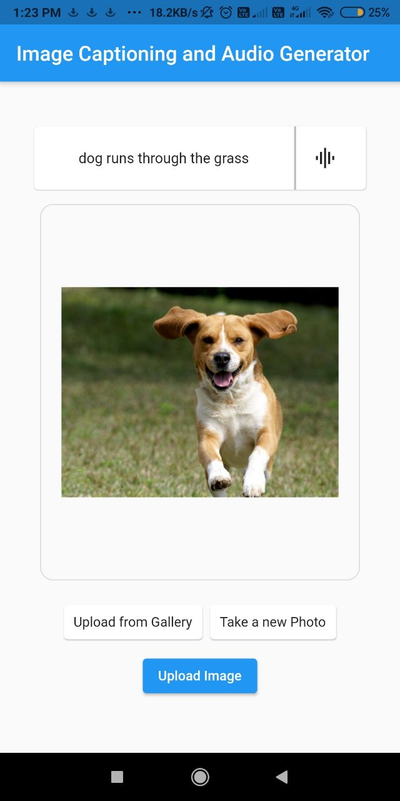
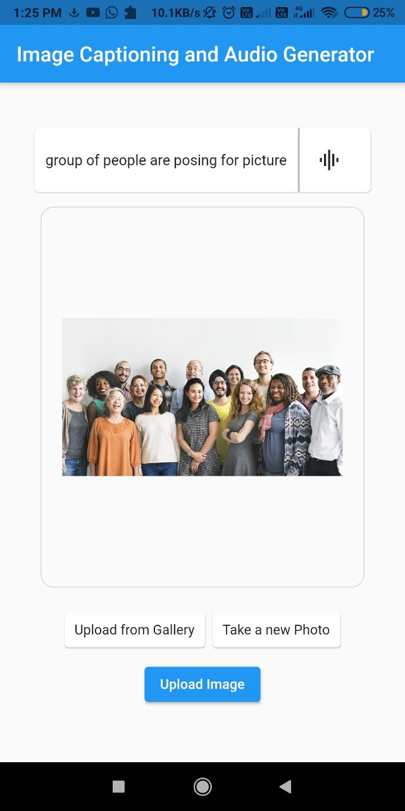

# imagecpation_generator
image caption generator using  neural networks
Flutter part is done here , ml and flask end is done in <a href="https://github.com/neeraj2403/Live-Image-Caption-Generator" target="blank">here!</a> 
Screenshots  

 1. **Select an image from your device** 

 2. **Upload the image**   
  
 3.**Obtain the caption as well as the audio** 
   
 Similar Screenshots 
  
  
  

