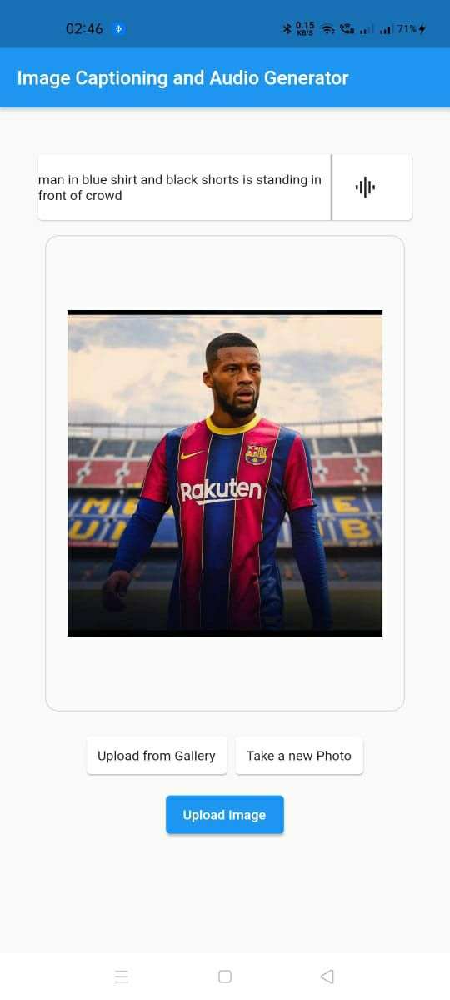
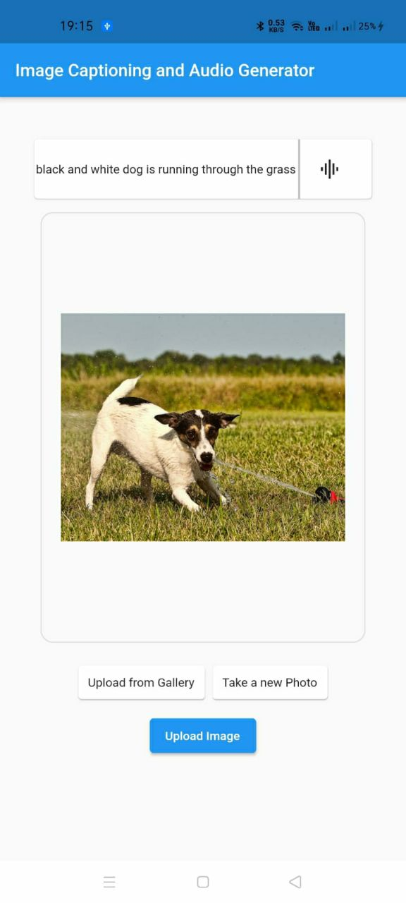

# imagecpation_generator
image caption generator using  neural networks
Flutter part is done here , ml and flask end is done in <a href="https://github.com/neeraj2403/Live-Image-Caption-Generator" target="blank">here!</a> 
Screenshots  

1.Select an image from your device 
 
2.Upload the image   
 
3.Obtain the caption as well as the audio 
 
Similar Screenshots 

<

 
